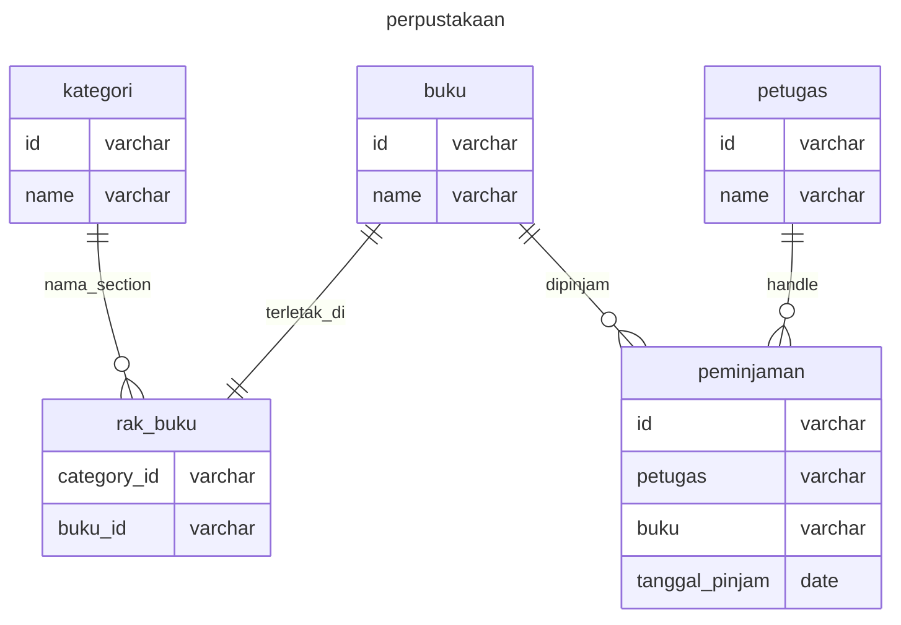

```mermaid
---
  title: perpustakaan
---
  erDiagram

  buku {
    id varchar
    name varchar
  }

  kategori {
    id varchar
    name varchar
  }

  rak_buku {
    category_id varchar
    buku_id varchar
  }

  petugas {
    id varchar
    name varchar
  }

  peminjaman {
    id varchar
    petugas varchar
    buku varchar
    tanggal_pinjam date
  }

  buku ||--|| rak_buku : terletak_di
  kategori ||--o{ rak_buku : nama_section
  petugas ||--o{ peminjaman : handle
  buku ||--o{ peminjaman : dipinjam
```
